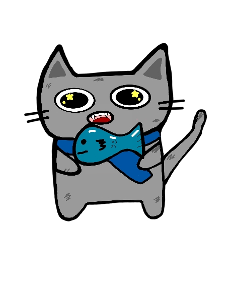

# Muffin Time

A cozy study & focus companion that brings your focus timer, calendar, tasks, stats, and lifestyle tracking into a single cosmic-night workspace.

## Meet Muffin

Say hi to **Muffin**, the official mascot of Muffin Time.

<p align="center">
  
  
  
</p>

## Overview

**Muffin Time** is a study/focus app first — the focus timer with per-subject tracking is the heart of it, and the calendar, tasks, stats, and lifestyle tabs orbit around it. It's built as a shared-but-personal daily driver: a quiet nighttime study den for long sessions.

## Key Features

- **Focus Timer**: A Pomodoro-inspired study timer with per-subject tracking, a floating timer that follows you across tabs, and editable sessions.
- **Calendar & Events**: Plan your week with a fluid event grid, recurring events, and a modal editor.
- **Drag-and-Drop Tasks**: Organize your to-dos with sortable, drag-and-drop task lists (powered by dnd-kit).
- **Time Insights**: Visualize your productivity with charts and heatmaps built on Recharts.
- **Lifestyle Tracking**: Gentle, personal tabs for period/cycle tracking, budgeting & expenses, and a gym/health routine.
- **Accounts & Sync**: Sign in with Supabase-backed auth so your data persists across sessions.
- **Cosmic Night Theme**: Immersive UI with stars, nebulae, and drifting shooting stars powered by Framer Motion, with `prefers-reduced-motion` respected throughout.

## Tech Stack


Also built with **React Router**, **Recharts** (charts), **dnd-kit** (drag-and-drop), **date-fns**, and **Zod** (validation).

## Getting Started

### Prerequisites

- [Node.js](https://nodejs.org/) (version 18 or higher)
- [npm](https://www.npmjs.com/)

### Installation

1. **Clone the repository**
   ```bash
   git clone https://github.com/jacho15/muffin-time.git
   cd muffin-time
   ```

2. **Install dependencies**
   ```bash
   npm install
   ```

3. **Configure environment variables**

   Create a `.env` file in the project root with your Supabase credentials:
   ```bash
   VITE_SUPABASE_URL=your-supabase-project-url
   VITE_SUPABASE_ANON_KEY=your-supabase-anon-key
   ```

4. **Start the development server**
   ```bash
   npm run dev
   ```

5. **Open in browser**
   Navigate to `http://localhost:5173` to see the stars!

## Testing

We use [Vitest](https://vitest.dev/) for unit and integration tests.

Run tests once:
```bash
npm run test
```

Start vitest in watch mode:
```bash
npm run test:watch
```

## License

[MIT](LICENSE) - See the LICENSE file for details.
